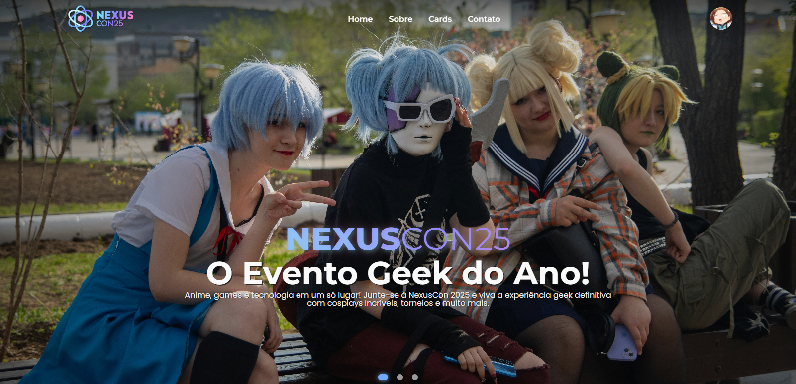

<h1 align="center">✨ NexusCon ✨</h1>

<section align="center">
    <h2>📑 Linguagens & Tecnologias Usadas 📑</h2>
    <div>
        
        
        
        
        
        
    </div>
</section>

<section align="center">
    <h2>📑 Documentação 📑</h2>
    <div>
        <a href="./docs/indexHtml.md">
            
        </a>
        <a href="./docs/styles.md">
            
        </a>
        <a href="./docs/scripts.md">
            
        </a>
    </div>
</section>

<br>

### 📃 Como usar o projeto?

- **Observação:** Instale programas como [git](https://git-scm.com/) para versionamento de código e clonagem do repositório, e [Visual Studio Code](https://code.visualstudio.com/) como editor de código. No entanto, escolha o editor de sua preferência!

- `1.` Baixe o projeto ou clone-o (Escolha um diretório para clonar o projeto no terminal):
```bash
# Clone o repositório
git clone https://github.com/Downzin01/NexusCon.git
```
- `2.` Entre na pasta do repositório:
```bash
# Vá para o repositório 
cd NexusCon
```
- `3.` Execute o comando para abrir o repositório no editor (VSCode):
```bash
code .
```
- `4.` Você pode abrir o arquivo principal (index.html) no navegador para visualizar a página. Porém, recomenda-se o uso da extensão do VSCode **Live Server** para rodar na localhost e visualizar o projeto em tempo real!

<div align="center">
  <h2>💻 Preview 💻</h2>
    <a href="http://downzin01.github.io/NexusCon/">
    
  </a>
  <br>
  <a href="http://downzin01.github.io/NexusCon/">
    
  </a>
</div>

<h1 align="center">💛 Contribuindo</h1>

> Gostaria de contribuir com suas próprias anotações ou recursos adicionais, sinta-se à vontade para fazer um fork deste repositório, adicionar suas contribuições e enviar um pull request. Sua colaboração é valorizada e pode ajudar outros alunos no aprendizado de JavaScript!

<section align='center'>
    <h3>💻 Contato 💻</h3>
    <p>
        <a href="mailto:dantasmatheus001@gmail.com">
            
        </a>
        <a href="https://www.instagram.com/downzin_" rel="nofollow">
            
        </a>
        <a href="https://x.com/DownloaderChan1" rel="nofollow">
            
        </a>
        <a href="https://discord.com/users/576935681167982595">
            
        </a>
    </p>
</section>